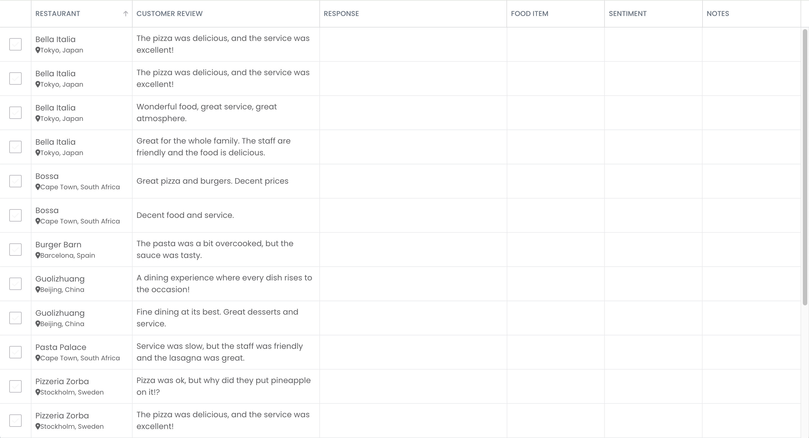

# Creating AI powered columns in Bryntum Grid: starter repository

The code for the Bryntum Grid with AI powered columns is on the `completed-app` branch.

## Getting started

Install the dependencies:

```bash
npm install
```

Install the Bryntum Grid by first getting access to the Bryntum registry using the [set up guide](https://bryntum.com/products/grid/docs/guide/Grid/npm-repository). You can then install the Bryntum Grid with one of the following commands:

- Trial version:

```bash
npm install @bryntum/grid@npm:@bryntum/grid-trial
```

- Licensed version:

```bash
npm install @bryntum/grid
```

Create and populate a local SQLite database with example reviews data using [Sequelize](https://sequelize.org/) ORM by running the `addExampleData` Node script:

```bash
npm run addExampleData
```

This creates SQLite database in the root folder, called `database.sqlite3`, and populates it with example reviews data.

The reviews data model is in the `src/models` folder. There are four API endpoints in the `src/index.ts` file for the Bryntum Grid to get reviews data from the local SQLite database and to sync data changes on the client to the database.

Create an OpenAI API key in your OpenAI [organization settings](https://platform.openai.com/settings/organization/api-keys).

Create a `.env` file and add the following environmental variables to it:

```
PORT=3000
OPENAI_API_KEY=your-openai-key
```

Run the development server for this Express app using the following command:

```bash
npm run dev
```

Open `http://localhost:3000`. You will see a Bryntum Grid:



Changes that you make to the Bryntum Grid will be saved in the local SQLite database.
